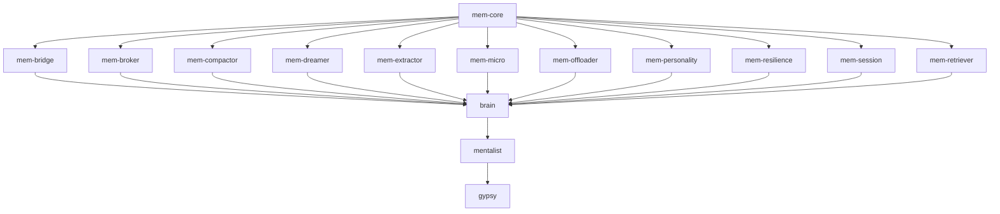

# MindPalace Dependency DAG

MindPalace is structured using a modular layered approach. The crates compile into the `brain`, which acts as the execution engine for the `mentalist` runner. 

## Dependency Graph

## Circular Dependency Prevention
- The architecture is strictly a DAG (Directed Acyclic Graph).
- `mem-core` holds all common structs (`Context`, `MemoryItem`).
- Feature crates (`mem-*`) import `mem-core` and DO NOT import each other unless via shared traits.
- `brain` aggregates feature crates.
- We utilize Cargo's native recursive workspace checking via `cargo check --workspace` in CI which inherently fails out on circular cycles at compile time.
